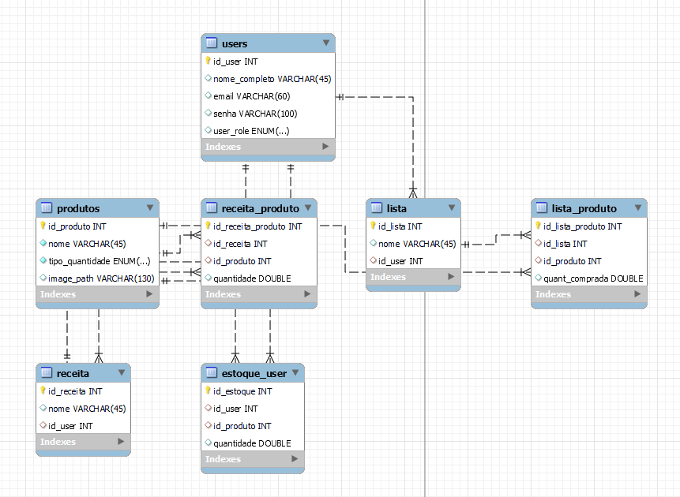

# Koala's Stocker

## Descrição

Projeto de Programação Web do segundo ano. A ideia era implementar um mini-sistema onde o usuario pode registrar suas compras de comida, podendo ter um melhor registro de seu estoque de comida.

## Páginas

- ### index.php

Página de Login e Signup

- ### main.php

Página principal onde o usuário logado tem acesso as suas ações.

- ### admin.php

Destinado ao administrador do sistema que tem sessão única e pode ter controle da entidade principal e compartilhada do sistema.

## Desenvolvimento

Você vai precisar de **Docker** instalado na sua máquina.

Ao dar **compose up** no arquivo **docker-compose-yml** o servidor php e mysql serão instalados na sua máquina.

## Database

Você consegue acesso a o dump da base de dados necessária para o sistema na pasta **dump**.

Só importar e caso as SP's não forem direto, só rodar o **koala_routines.sql** que está no dump manualmente.

Existem dois usuários cadastrados:

- Admin =
Email: lucas@gmail.com | Senha: pastel2020

- Default = 
Email: matheus@gmail.com | Senha: pastel2020 

Caso tenha curiosidade em ver como ficou o diagrama do banco de dados.

